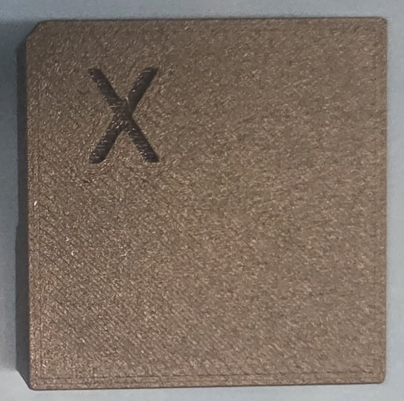
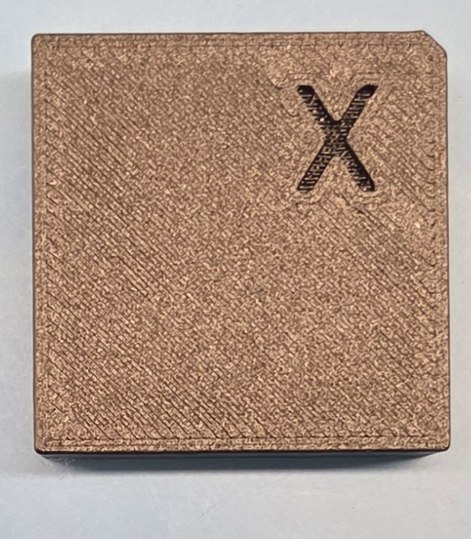

# Module Insertion into Readout Board

This SOP details how to insert modules that do not have a baseplate into the readout board using our insertion tooling.

## Materials
- Module (in plastic cover)
- Readout board
- Insertion block
- Insertion collar

|Insertion block (left) and Insertion collar (right)|
|-|
||

## Plastic Cover Notice

You should **always** keep your module inside of it's plastic cover unless it is strictly necessary to remove it. If the plastic cover is removed, the wirebonds become very vulnerable, and are highly prone to getting damaged. The insertion procedure we describe below accommodates this requirement.

## Procedure

1. Gather your module and readout board (RB). Your module should be in its plastic cover
2. Lay the RB flat on the table, with the module connector side up.
3. Orient your module so that the notch in the cover lines up with the notch in the module outline on the RB.

This is what the orientation of the pieces should look like at this point.

|Steps 1-3|
|-|
||

4. Remove the sliding window of the module cover.

|Steps 4|
|-|
||

5. Slide on the insertion collar. Ensure that the notch in the insertion collar is in the same corner as the notch in the module cover.

|Step 5|
|-|
||

6. Line up the connectors on the module PCB and the RB. The easiest way to do this is by aligning the screw holes at the top and bottom of the module PCB. In the picture below, these screw holes are circled in blue. Again, ensure that the notch in the module cover lines up with the notch in the module outline on the RB.

|Step 6|
|-|
||

7. Select the correct insertion block for your specific module. Depending on how many chips are on the module (whether it's fully or partially populated), and where they are located, you will need to use different insertion block types. Below our the three relevant block types. Note that the asymmetric blocks have an "X" on the top of them, which is used for helping you orient the block.

For the explanation below, take the orientation to be how the module in the pictures above is sitting (e.g. the hybrid is in the "top left"). For example, for the module in the pictures above, I would select asymmetric block 1.

- Symmetric block
    - Use for fully populated modules. This block makes even/symmetric contact with the four ETROCs/hybrids.
- Asymmetric block 1 ("X" in top left or bottom right)
    - Use for:
        - Singly populated modules with the chip in the top left or bottom right
        - Triply populated modules with the empty space in the top left or bottom right
- Asymmetric block 2 ("X" in top right or bottom left)
    - Use for:
        - Singly populated modules with the chip in the top right or bottom left
        - Triply populated modules with the empty space in the top right or bottom left

Since the two asymmetric blocks look quite similar, here are side by side pictures that should help differentiate them. If you happen to try to use the wrong one, you'll find that the block does not fit through the collar when trying to push it through.

|Asymmetric block 1|Asymmetric block 2|
|-|-|
|||

8. Orient the insertion block so that the "X" is hovering over the one chip for the singly populated module case, or hovering over the one empty space for the triply populated module case. This step is not relevant for the symmetric block. 

9. Push the insertion block through the insertion collar. Apply gentle pressure until the module seats into the RB connector. 

10. Remove the insertion block.

11. Slide off the insertion collar and slide the module cover back on.

12. To take the module off the RB, you can gently pry the module PCB from any of it's corners until it unseats. Do this carefully. 