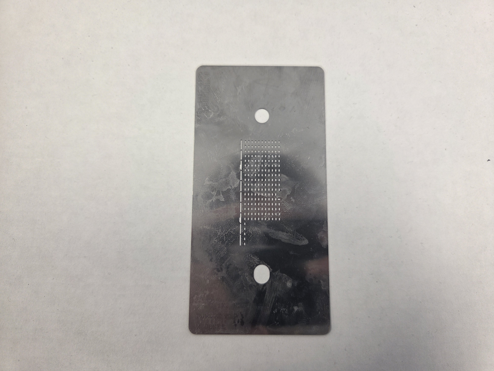
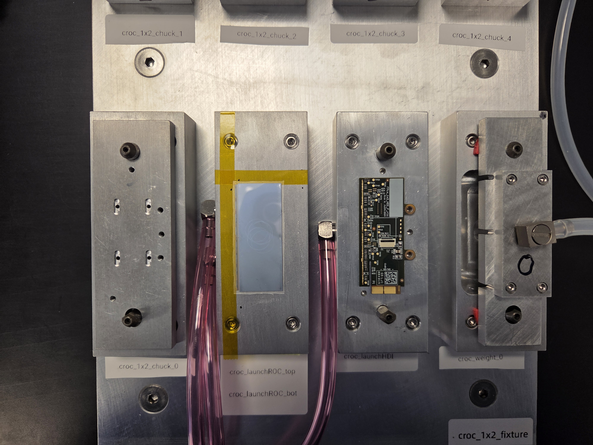
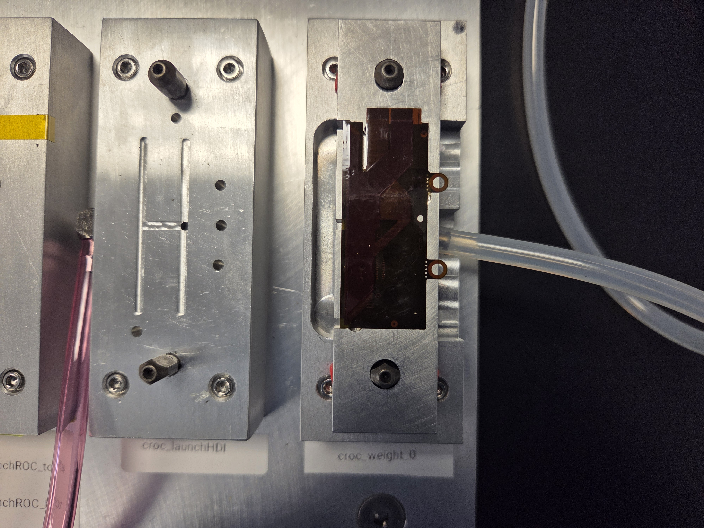
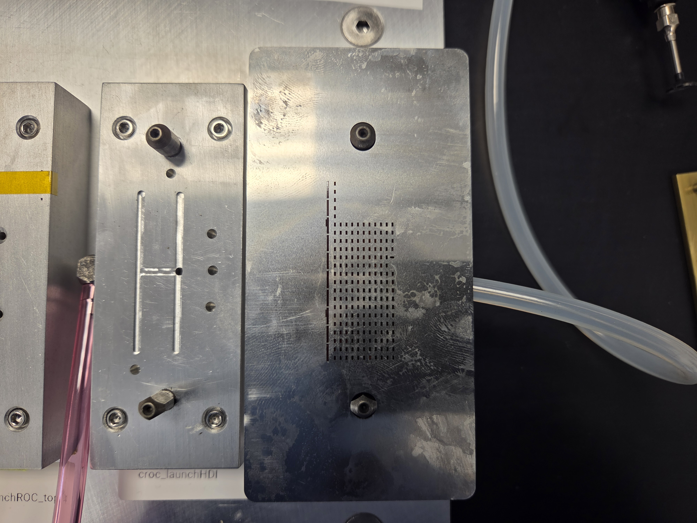
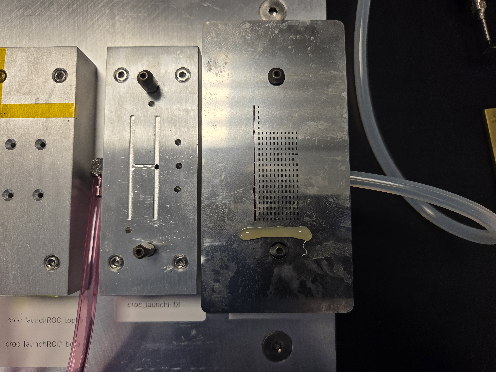
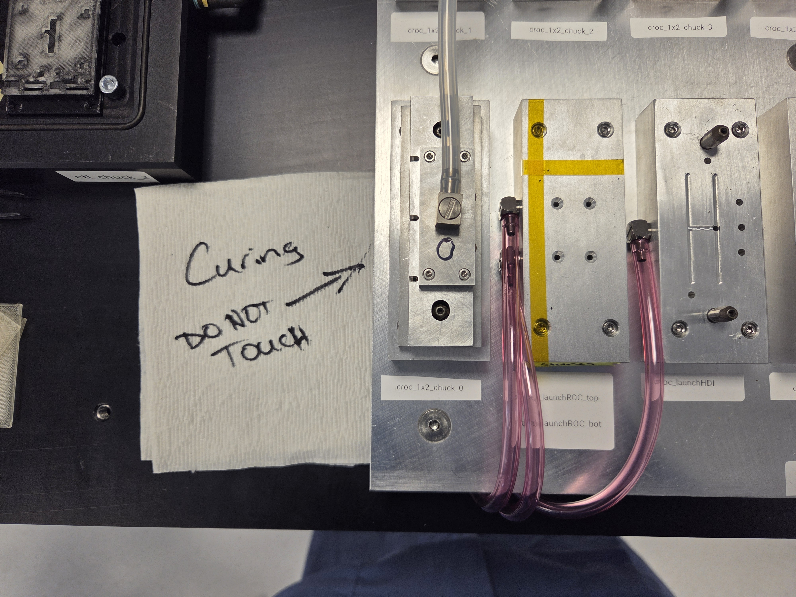

# TFPX-101 Module Gluing

`Introduction Placeholder`

## Required Materials

General Comments

  - [ ] Add pictures of all required materials

- Module components
    - Pre-production HDI
    - Sensor-ROC Assembly (SRA, ROC: Readout chip)
- Gluing materials
    - Glue
    - Mixing nozzle
    - Stencil
    - Glue spreader (e.g. plastic card)

|Glue|Mixing nozzle|Stencil|Glue spreader (e.g. plastic card)|
|-|-|-|-|
|||||
- Equipment
    - Gantry
    - 1x2 module assembly gantry tooling
    - Gelpak vacuum tooling
    - High precision scale
    - Microscope

## Procedure

### Step 1: Inspect parts

Upon receiving new components, conduct a detailed inspection of the SRAs to spot for any damage done prior to our handling of the components/module. Any damage done after this point will ideally be easier to pinpoint to a specific mishandling or part of our procedure that can be learned from and avoided in the future. A sufficient inspection entails pictures of both sides of the SRA that would capture any chips or scratches. Any noticeable damage to the HDI should also be documented. 

The picture of the SRA can be done with either a microscope or the gantry camera. Here is an example of a set that captures the entire SRA using the microscope.

||Chip 12|Chip 13|
|-|-|-|
|ROC Side|||
|Sensor Side|||

Here is a method for taking these that minimizes handling:
1. Put on nitrile gloves in addition to required cleanroom apparel
2. Image the SRA while it's in the gelpak (ROC side should be facing up on arrival)
3. Put gelpak on the gelpak vacuum release tooling
4. Open gScript Interpreter in nonvirtual mode
5. Turn on the vacuum line (gScript command: `setvac gelpak_release 1`)
6. Pick up the SRA with a vacuum pen and place it in your gloved hand palm up
7. Flip the SRA with the rubber lip of the vacuum pen
8. Place the SRA back in the gelpak with the vacuum pen
9. Turn off the vacuum line (gScript command: `setvac gelpak_release 0`)
10. Image other side

### Step 2: Weigh and stage parts

To know how much glue was used to adhere the module together, weigh the components before the assembly and the module after assembly, and subtract the difference. Here is how to do this step safely:

1. Put on nitrile gloves in addition to required cleanroom apparel
2. Remove everything from the high precision mass scale
3. Close the sliding glass doors of the scale
4. Press the "UNITS" button on the scale until the unit on the right side of the display is milligrams (mg)
5. Make sure the scale's idle reading is zero (press "->0<- DELETE" or "->T<- TARE" button if nonzero)
6. Open one of the scale's sliding glass doors
7. Place SRA gelpak on the gelpak vacuum release tooling
8. Open gScript Interpreter in nonvirtual mode
9. Turn on the gelpak tooling vacuum line (gScript command: `setvac gelpak_release 1`)
10. Pick up SRA with vacuum pen
11. Carry SRA over to the high precision scale using vacuum pen, having your gloved hand hovering under the SRA in case the suction fails
12. Gently place the SRA in the center of the scale's metal plate through the open door
13. Close the sliding glass door
14. Wait for the scale's stability indicator to light up on the left side of the display (mirrored right triangles converging at a single point)
15. Record the mass to the precision to as many decimals as it shows on the display
16. Open the sliding glass door
17. Pick up SRA with vacuum pen
18. Carry SRA over to the gantry 1x2 assembly tooling using vacuum pen, having your gloved hand hovering under the SRA in case the suction fails
19. Gently place the SRA on the ROC launch chuck (sensor side up, wirebond pads on the right)
20. Using the vacuum pen, gently push the SRA into the corner of the two strips of kapton tape
21. Turn off the gelpak tooling vacuum line (gScript command: `setvac gelpak_release 0`)
22. Remove HDI from its bag using vacuum pen
23. Carry HDI over to the scale using the vacuum pen, having your gloved hand hovering under the HDI in case the suction fails
24. Gently place the HDI in the center of the scale's metal plate through the open door
25. Close the sliding glass door
26. Wait for the scale's stability indicator to light up on the left side of the display (mirrored right triangles converging at a single point)
27. Record the mass to the precision to as many decimals as it shows on the display
28. Open the sliding glass door
29. Pick up the HDI with the vacuum pen
30. Carry HDI over to the gantry 1x2 assembly tooling using the vacuum pen, having your gloved hand hovering under the HDI in case the suction fails
31. Gently place the HDI on the HDI launch chuck (component side up, two screw holes on right)
32. If the HDI is noticeably warped, gently bend it so it lays flat on the chuck
33. Align the two screw holes in the HDI with the two screw holes in the chuck
34. Add the masses of the HDI and SRA together

Below is an image of what the components should look like after they are staged:

|Staged Components|
|-|
||

### Step 3: Run assembly script

We are now ready to run our gantry script. Open the gScript Interpreter, select to run in nonvirtual mode, click load script, and navigate to the assembly script. The current path for the assembly script is: 

`./gantry-config-bu/Scripts/TFPXModules/Pre-Production Scripts/Assemble_1x2_sensor.gscript`

Then click run script and follow the instructions in the pop-ups. Once you arrive at the gluing step, follow these instructions (see below for images):

1. Pick up the HDI weight tool
2. Flip it over about its short edge 
3. Place it down on the weight tool 0 chuck (HDI side up, HDI screw holes on right)
4. Make sure the weight tool is pushed down the pegs all the way and the hose is fed to the right
5. Place the glue stencil over the HDI (align the separated strip of holes in the stencil with the separated strip on the HDI)
6. Make sure the stencil is flush with the HDI
7. Gather glue materials (glue gun, mixing nozzle, glue spreader, paper towel)
8. Place a paper towel on gantry table, this is where you will place things with glue on them so you don't make a mess
9. Take off the cap on the glue gun and put on a mixing nozzle
10. Deposit a line of glue a below the lowest row of holes, but above the peg holding the stencil in place
11. Place the glue gun down with the nozzle over the paper towel
12. Pick up the glue spreader with your dominant hand
13. Use your pointer finger and thumb to apply pressure on the stencil above the top peg and below the bottom peg, respectively
14. Position the spreader below the line of glue
15. In one motion, slowly drag the spreader towards the top peg stopping after you have passed the top row of holes
16. Still applying pressure on the stencil, lift the spreader off the stencil and place it on the paper towel
17. Grab the top and bottom edges of the stencil and lift it straight off the HDI
18. Place stencil on paper towel

|Step 3/4|Step 5/6|Step 10|
|-|-|-|
||||

At this point, you can continue with the script, which will then do a survey of the glue pattern, which you should look at to ensure there is glue in all the spots there should be.

|Glue Survey Example|
|-|
||

You can now continue through the script until you have completed the final step of measuring the fiducials on the placed HDI. Lastly, save the assembly log file and glue survey image, both of which are found in the logs directory (`./gantry-config-bu/Logs/`).

### Step 4: Cure module

After the assembly script, you must let the glue cure for at least 8 hours. Make sure to leave the vacuum lines of both the assembly chuck and HDI weight tool on. Also direct the hose of the weight tool upwards as seen in the picture below. Lastly, put a note next to the curing module saying "DO NOT TOUCH, GLUE CURING" or something along those lines so no one unknowingly interferes with this process.

|Curing|
|-|
||

You should also take this time to clean the materials that have glue on them. You can take off the mixing nozzle and dispose of it. Make sure to wipe the end of the glue gun before putting the cap back on. For the dirty stencil and spreader, try to wipe off as much glue as you can using a paper towel. You can then clean the rest of the glue off using acetone and another paper towel.

### Step 5: Run survey script

After enough time as passed, load the survey script, which will measure the relative alignment of the two parts. That script is currently in the following location:

`./gantry-config-bu/Scripts/TFPXModules/Pre-Production Scripts/Survey_1x2_sensor.gscript`

Run the script and follow the prompts that pop-up. Select the precise option for measuring the fiducials. After the script completes, save the survey log file, which is found in the logs directory (`./gantry-config-bu/Logs/`).

### Step 6: Weigh module

You can now pick the module up with a vacuum pen and weigh the module with the high precision scale following a similar process as the earlier weighing. Record the mass and subtract off the sum of the earlier measurements of the individual components.

$m_{\text{glue}}=m_{\text{glued module}}-(m_{\text{SRA}}+m_{\text{HDI}})$

Record this value.

### Step 7: Update the Purdue DB

Log into the Purdue database ([login page](https://www.physics.purdue.edu/cmsfpix/Phase2_Test/main.php)) and login. Here's what to do from there:

1. Click the "Inspect part (read/write)" button
2. Type in the serial number of the module you're assembling into the "Serial #" field (e.g. RH0136)
3. Click the search button (pressing enter won't work)
4. Click the "Edit" button on the left side of the module's entry
5. Click the "Status" dropdown and change it to "Glued"
6. Click the "Update" button
7. Scroll down to the "Add data" section
8. Next to the "Add data" button, click "Browse..." and select the assembly log file
9. Type "Assembly log file:" in the description field
10. Click the "Add data" button
11. Repeat steps 7-10, but with the survey log file (type "Survey log file:" in description field)

### Next steps

You can now screw the module into the module carrier using two M2.5 button-head screws. DO NOT TIGHTEN TOO HARD. They are only meant to hold the module in place, there should be no force exerted on the module from the screws. If the side opposite of the screws is lifted off the module carrier, then you have tightened the screws too much. At this point, you can now place the carrier on a module assembly chuck and continue with the spacer installation. Otherwise, it should be placed in the dry air cabinet until you are ready to install the spacer.
