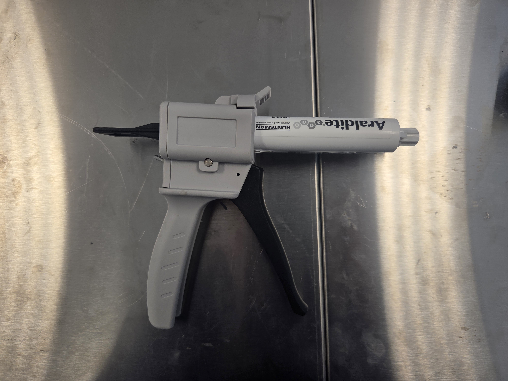
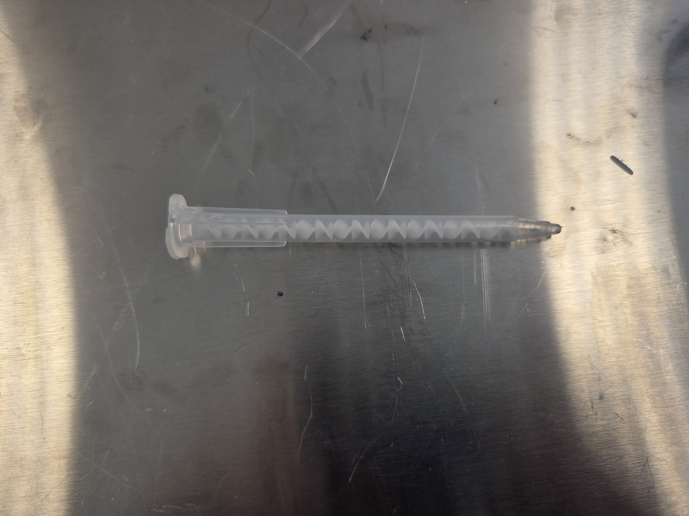
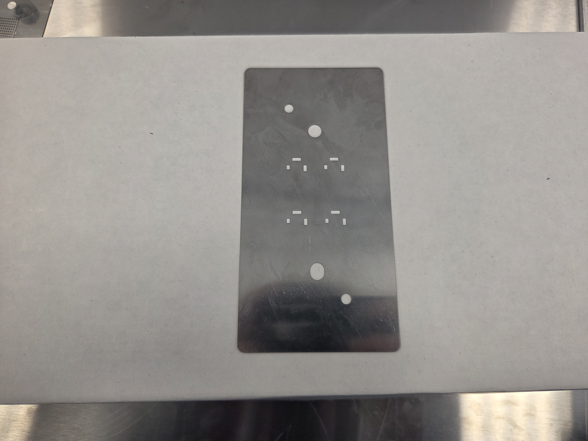
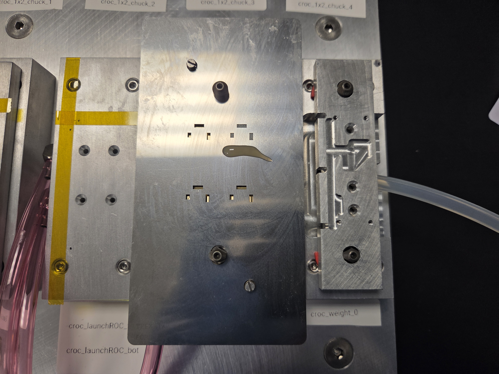
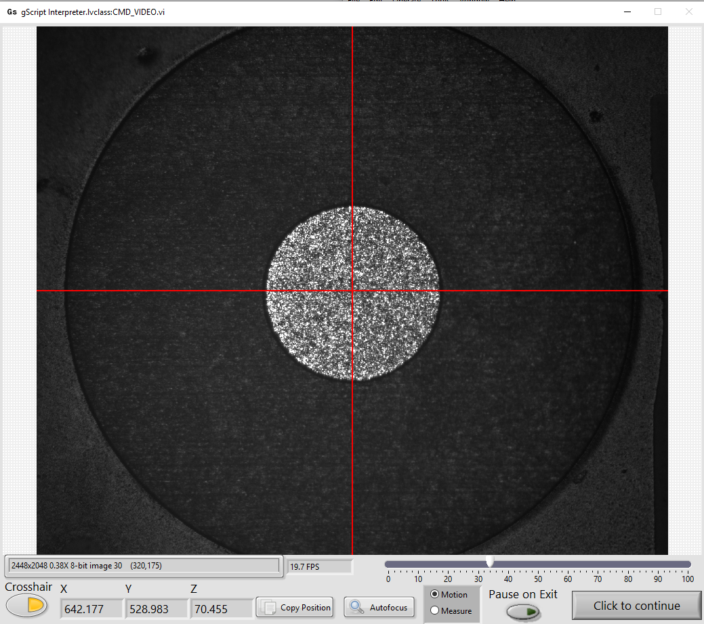
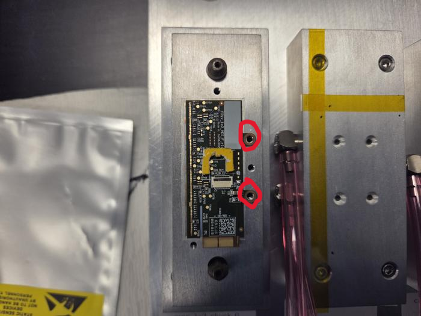

# TFPX-102 Spacer Installation

This SOP details how to install a spacer onto a glued 1x2 sensor module.

## References

  - Purdue spacer installation SOP: https://github.com/bu-etl/Lab-Instructions/blob/main/SOPs/TFPX-102-materials/TFPX%20Spacer%20SOP.pdf

## Required Materials

- Glued module
- Spacer
- Gluing materials
    - Glue
    - Mixing nozzle
    - Stencil
    - Glue spreader (e.g. plastic card)

|Glue|Mixing nozzle|Stencil|Glue spreader (e.g. plastic card)|
|-|-|-|-|
|||||

## Procedure

### Step 0: Calibrate gantry

You should make sure that the relevant calibrations for this procedure have already been done. If you are unsure, you should ask an advisor or you can do a dry run of the script and see if the spacer gets placed where you expect it to. For a dry run, you should use a bare HDI in place of a glued module and you should not actually use any glue (hence 'dry') in step 2.

In the event the calibrations need to be done or redone, you should follow the instructions in [this calibration SOP](./TFPX-102-materials/TFPX%20Spacer%20SOP.pdf) made by the team at Purdue (linked above as well). Particularly, you should make sure the SSCO (Spacer Sucker Camera Offset) vector is calibrated. This gives the displacement vector between the camera focal point and the center vacuum hole in the spacer sucker tool. Additionally, you should check that our site config file contains the correct values for each variable that the document lists out. Note that those values in the document are particular for Purdue, and that ours will be different, so do not just copy them over. The site config file containing the all the variables with site-specific values can be found at this path: `./gantry-config-bu/Config/TFPX/CROC1x2_Site_Config.txt`. If you need to measure any new values (e.g. the SSCO vector or the pin location of one of the chucks), you should put the new value in this file and save it. The format for the variable definitions can be seen in the below examples:

```
focus_1x2_hdi_launch: 77.382407
small_ssco: {0.680517,105.374218,-5.563789}
```

Note that you CANNOT put a space before or after commas for vectors in gScript.


### Step 1: Stage parts

Place the module carrier on which the glued module is screwed in onto the desired chuck. Make sure the screws are on the right side of the chuck. 
1. Next, place the brass fixture with the pegs in the top left and bottom right corners on the HDI launch chuck. Place the spacer kapton tape side down in the desired slot (0, 1, 2, 3).

|Step 1|
|-|
||

2. Then, place the stencil over the spacer, ensuring the orientation of the stencil is correct (horizontal line on top and larger vertical line on right). Put a mixing nozzle on the glue gun and deposit a line of glue below only the spacer you wish to glue. Do not put glue below empty holes. Then, slowly spread the glue upwards with the glue spreader.

|Step 2|
|-|
||

3. Lift the stencil off the spacer, being careful that the spacer is not lifted with the stencil. If does lift with the stencil, use tweezers to carefully place it back in the desired location. Then, place the other brass fixture over the spacer, ensuring the orientation is correct (holes should be oriented the same as the stencil).

|Step 3|
|-|
||

4. Pick up the brass sandwich and flip it about its long edge.

|Step 4|
|-|
||

5. Remove the top brass piece, being careful that the spacer is not lifted with it. If the spacer is lifted, carefully place it back where it was.

|Step 5|
|-|
||

### Step 2: Run installation script

You can now load the spacer installation script into the gScript Interpreter, which can be found at:

`./gantry-config-bu/Scripts/TFPXModules/Pre-production Scripts/Spacer_1x2_sensor.gscript`

Run the script and follow the prompts in the pop-ups. The spacer locations are labeled on the brass fixture (0, 1, 2, 3). See below for what the HDI fiducial markers should look like.

|HDI Fiducial Marker|
|-|
||


Once the gantry places the spacer and completes the script, save the generated log file in the Logs directory (`./gantry-config-bu/Logs/`).


### Step 3: Cure spacer

Let the spacer cure for at least 3 hours before you attempt to wirebond. Place a note saying "DO NOT TOUCH, GLUE CURING" next to the module so no one unknowingly interferes with this process.

### Step 4: Update Purdue DB

Navigate to the Purdue database ([login page](https://www.physics.purdue.edu/cmsfpix/Phase2_Test/main.php)) and login. Here's what to do from there:

1. Click the "Inspect part (read/write)" button
2. Type in the serial number of the module you're assembling into the "Serial #" field (e.g. RH0136)
3. Click the search button
4. Click the "Edit" button on the left side of the module's entry
5. Click the dropdown next to the "New property:" field and select the "Spacer installed" option
6. Enter the day the spacer was installed in the date field to the right of the drop down
7. Click the "Update" button below 

### Next steps

After the glue is cured, you can now screw the module into the assembly carrier it's on using two M2.5 screws in the two locations circled in red below. Do not tighten the screws! Only turn them until the heads start to make contact with the HDI. The module must remain flat on the carrier and over-tightening the screws will cause the module to tilt.

|Assembly Carrier Screws|
|-|
||

At this point, you can now begin the wirebonding process immediately, or put the module/assembly carrier into the dry air cabinet to continue it at a later time.
