# TFPX-103 CROC 1x2 Module Wirebonding

`Introduction Placeholder`

## Required Materials

- Glued module (with spacer) screwed to assembly carrier
- TFPX 1x2 Module Wirebonding Plate
- Equipment
    - Hesse BJ855 Automatic Wirebonder
    - Microscope
    - USB Thumb Drive

## Procedure

### Step 0: Pre-flight checks

Before you begin the wirebonding on a real module, it is helpful to first check some aspects of the bonder and do some manual bonds to make sure it is functioning as expected.

The first thing to check is the wire feeding out of the bondhead in the "E-Box." You can do so by pressing the button labeled "E-Box" on the keypad and confirming the action by pressing the "OK" button. See below for an image of the keypad and what the bondhead should look like in the E-Box.

|Keypad|
|-|
|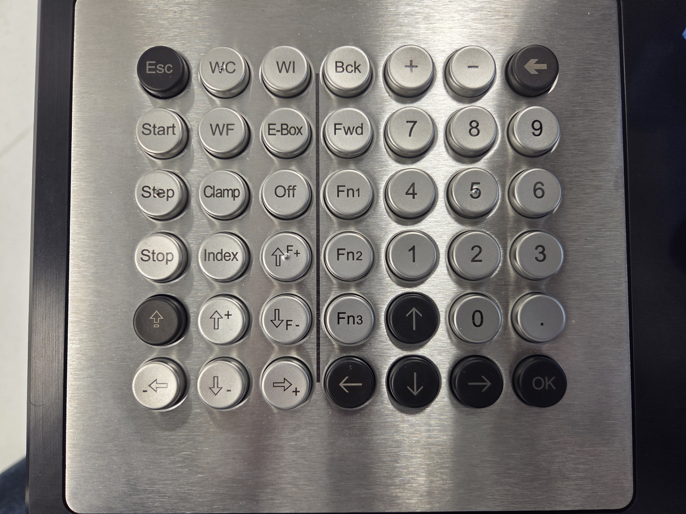|

|E-Box|
|-|
|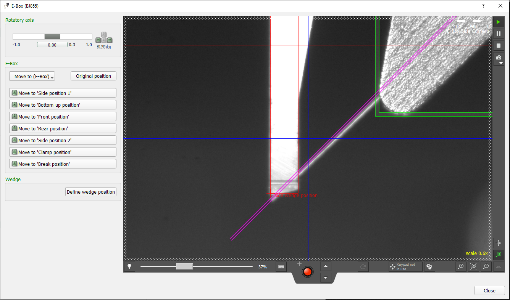|

To do some manual bonds, which you will need to know how to do later for the pull test, IREF trim bit, and bias wires, you can follow this protocol:

1. Press the manual bonding mode button on the keypad labeled "Fn2." This should move the bondhead to the manual bonding station.

|Manual Bonding Station|
|-|
|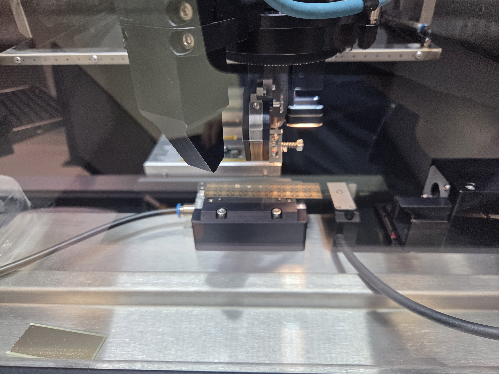|

2. Define the wires you'd like to place. You can do so by pressing the "Define wires..." button in the manual bonding window. You should supply the following information in the window that pops up:

|Manual Bonding Window|
|-|
|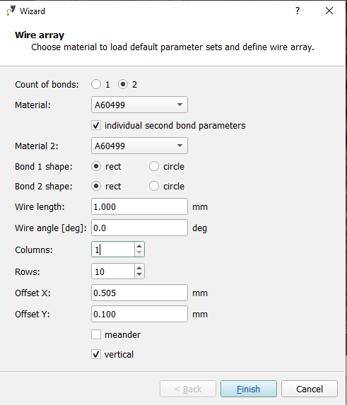|

- Wire length (mm)
    - This sets the length of the wire(s) you will place relative to the first bond foot
- Wire angle (deg)
    - This sets the angle of the wire relative to the positive x-direction, which is taken to be to the right when looking through the bondhead camera
    - You may set a value between -180 and 180
        - 0 degrees means wire feeds horizontally to the right (+x) relative to the first bond foot
        - 90 degrees means the wire feeds vertically upwards (+y) relative to the first bond foot
        -  -90 degrees means the wire feeds vertically downwards (-y) relative to the first bond foot
        - etc.
- Columns
    - If you are going to manually bond more than one wire, this option lets you choose how many columns of wires you want
- Rows
    - Similarly, this option lets you choose how many rows you want
- Offset X (mm)
    - This sets the horizontal offset between multiple columns of wires
- Offset Y (mm)
    - This sets the vertical offset between multiple rows of wires

- For a quick test on the manual bonding station, you can use the values below as a reference
    - Wire length: 1.00
    - Wire angle: 0
    - Columns: 1
    - Rows: 10
    - Offset Y: 0.100
    - Note since we only have 1 column, the Offset X value is not relevant
- A helpful note is that the camera window (both in the main window and in the manual bonding window) has a measurement tool (see ruler icon to the left of the red joystick in the image below). When you click the button, and then click two locations within the camera window, it will tell you the distance between those two points. This is VERY helpful sometimes for determing the manual bonding values above, especially for the manual bonding you will do for real modules.

3. Define the position of the first bond foot of the first wire. You can do this by pressing the "Define position" button and the clicking in the camera window where you want the first bond foot of the first wire. After doing so, make sure that the wires will not go off the bonding station or collide with wires that may already be on the manual bonding station. It should look something like this:

|Manual Bonding Wires|
|-|
|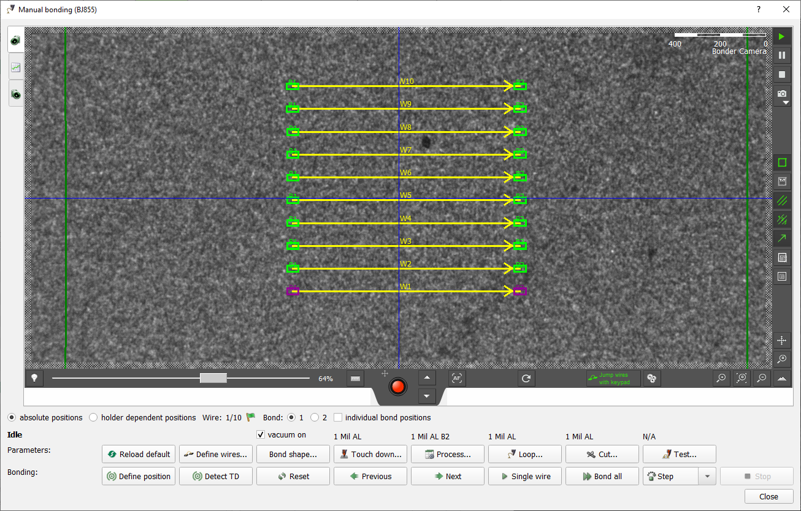|

4. You should now press the "Detect TD" button to detect touchdown. This calibrates the z coordinates of the bond feet very precisely.

5. After doing so, you may begin bonding by pressing the "Single wire" button or the "Bond all" button if there are multiple wires. You can bond multiple wires one at a time by repeatedly pressing the "Single wire" button.

6. Check that all the wires were placed and that none of the wires look broken.

### Step 1: Stage module

Slide the assembly carrier on which the glued module is screwed in into the TFPX 1x2 Module Wirebonding Plate. Unlock the wirebonder window by turning the "A-Mode" key, and place the fixture onto the vacuum chuck. Orient the fixture so the wirebond pad side of the module is the side closest to you. Push the fixture corner into the sets of pegs to make alignment easier. Slide the wirebonder window back up and press the "CLAMP" button on the keypad to turn the vacuum on. You must be logged in to turn on the clamp. You can check that the clamp is on by looking at the clamp status icon at the top of the screen. Below is a picture of what the icon should look like.

|Clamp off|Clamp on|
|-|-|
|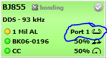|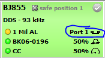|

### Step 2: Load program

Click the folder icon in the top left to load a bond program. Navigate to the desired program, currently named `TFPX_CROC_1x2_SensorModule_WireClasses`.

### Step 3: Define frames

Navigate to the "Define units" tab. Click on the HDI object in the "Aufnahme" drop down. Move the camera to the bottom left corner of the HDI using the red camera joystick.

INSERT PICTURE OF CORRECT LOCATION

Once the crosshair is on the bottom left corner of the HDI, click the "Define origin" button on the left panel. It is important that the HDI object is selected when you click this button so the settings are saved properly. Next, adjust the focus (up and down arrows to the right of the red joystick) and lighting (slide bar to the left of the red joystick) until the HDI bondpads are in focus and reasonably bright. Then, click the "Define focus and lighting" button on the left panel. 

Repeat this process with the SRA by clicking the SRA object in the drop down. Like the HDI, navigate to the bottom left corner of the SRA and click the "Define origin" button. Then, adjust the focus and lighting and click the "Define focus and lighting" button.

### Step 4: Perform alignment

Click the CROC_1x2_Sensor_Module object in the "Aufnahme" drop down and then click the "Start alignment button" on the left. It is this small icon:

|Start alignment button|
|-|
|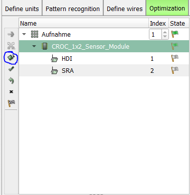|

The wirebonder will then quickly align the two parts, and will calculate where the bond feet should be. If the yellow lines representing the wires are not visible, enable this using a button on the right side of the camera panel:

|Wire visibility button(s)|
|-|
|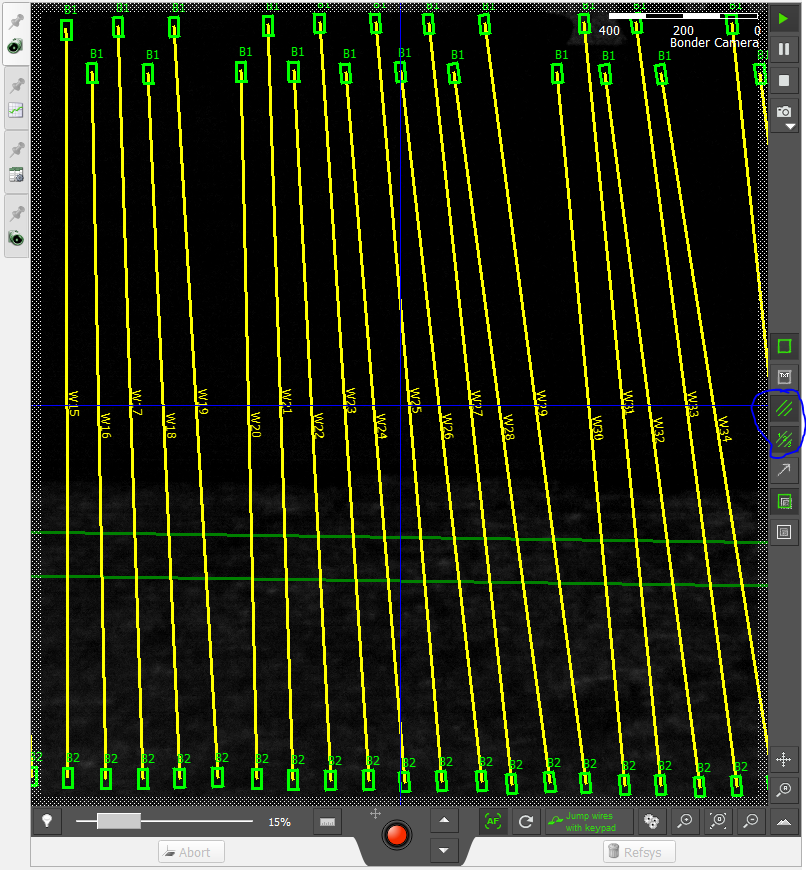|

If one of the two sets of bond feet are systematically misaligned (e.g. consistently too far to the left side of the bond pads), you can retry the alignment for that part by clicking that object in the drop down and clicking the start alignment button. Once most of the bond feet look good and centered on the pads, you can now adjust any single bond feet that are still not properly centered on their respective bond pads. This can be done by navigating to the "Optimization" tab, entering correction mode by clicking the "Correction" button on the left panel, and dragging the bond feet in the camera window to the desired location. Double check all bond feet on both components are centered well enough. Exit correction mode by clicking the "Correction" button again. 

### Step 5: Bond HDI/SRA wires

Still in the "Optimization tab," click the HDI object in the drop down and click the "Detect touch down" on the left panel. It should now touch down on the first bond pad on both the HDI and SRA to calibrate the height. After it's done, it should be hovering over wire 9 (which is first in the bond order). Note the wire numbers do not correspond to the actual bond order.

Make sure the deformation graph is cleared out, which can be done by navigating to the graph tab on the left panel of the camera and clicking the "Clear all process curves" button:

|Deformation data tab|
|-|
|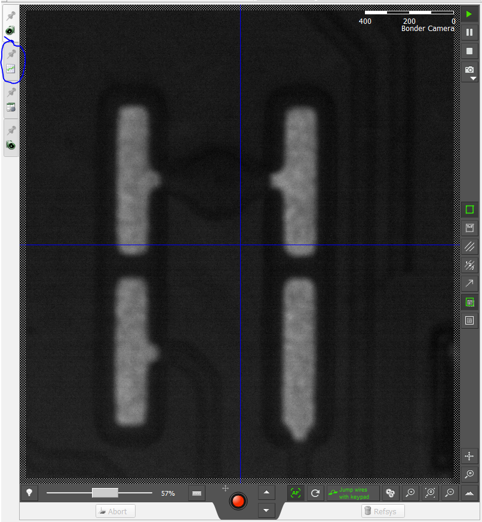|

You can now start the bonding by clicking the "All wires (Start)" button on the left panel. The bottom camera tab provides the best angle for watching the bonding. Wait for the bonding to complete, and then look over the bonds.

If any bonds are missing, you can retry individual wires by selecting the wire you wish to redo (something like W50 in the bottom left drop down), right-clicking it, and resetting its state. To ensure it will do the correct wire, make sure that the order number for the wire matches what is displayed in the selection area. In the image below, 

|Selected Wire|
|-|
|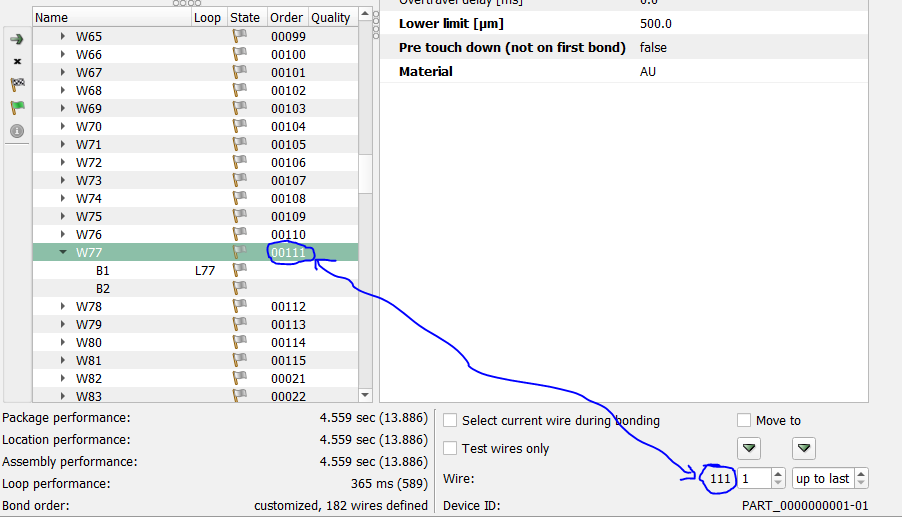|

You can now press "Detect touch down" and then "Single wire."

### Step 6: Export deformation data

Navigate back to the deformation data tab and click the "Save process curves" button (see below), and save the file to a flash drive. Follow the file name convention below, replacing RH0142 with the module serial number you're assembling and Chip12 with the chip number you just bonded (either Chip12 or Chip13):
```
RH0142_Chip12_Deformation.btd
```

It will save as a .btd file, which can be parsed with a script (see [this script](./TFPX-103-materials/BTDParser.py) in the materials folder for this task). Alternatively, take a screenshot of the deformation graph and save that. After saving the data, you can now clear the process curves.

### Step 7: Repeat steps 3-6 for the second chip on the module

This step is self-explanatory, just make sure to reset the state of all wires and ensure that wire 9 will be the first one bonded. 

### Step 8: Bond specialty wires manually

Apart from the main wirebonds between the HDI and SRA, there are three sets of wirebonds you must do manually: the bias wires, pull-test wires, and trim bit wires. To enter manual bonding mode, click the "Fn2" button on the keypad and press "OK." You should then use the red joystick at the bottom of the camera window to move the camera over towards the HDI.

Please follow the detailed instructions for how to place manual bonds detailed in step 0 in the pre-flight checks. Below is a table of reference values that we've found work for us which you can use as a starting point for determining your "Define wires..." values.

||Pull test|Trim Bit|Bias|
|-|-|-|-|
|Wire length (mm)|1.450|0.800|1.300|
|Wire angle (deg)|90|90|180|
|Columns|1|1|1|
|Rows|1|1|3|
|Offset X|n/a|n/a|n/a|
|Offset Y|n/a|n/a|0.100|

For the offsets, n/a just means not relevant since you should do these one at a time (1 row, 1 column). For the pull test and trim bit wires, define the position on the bottom bond pad if you enter 90 deg for the angle. For the bias wires, define the position on the right HDI bond pad rather than on the sensor if you enter 180 deg for the angle.


To do the trim bit wires, you must first figure out what the correct configuration of wires is (this changes from module to module). This information can be found on the [Purdue DB](https://www.physics.purdue.edu/cmsfpix/Phase2_Test/login.php?) entry for the module you are assembling. See this example.

|Purdue DB Entry|
|-|
||

The left image at the bottom will be the pads you are looking for on the left side of the module, and the right image are the pads you are looking for on the right side of the module. Make sure that you refer to the correct image when bonding these wires. Once you find the pads, bond vertical wires where the image has a red line, skipping the pads where the image has a gray line.

For the locations of the pull test and bias wires, refer to this image where the pull test is the lower left blue circle and the bias is the upper right blue circle:

|Pull test and bias wires|
|-|
||

### Step 9: Inspect and image wirebonds

Once you are ready to remove the module from the wirebonder, press "Clamp" to turn off the vacuum (this should also unlock the window), and pick up the module carrier. Take it over to a microscope and inspect the wirebonds, making sure there are wires everywhere there should be. Take and save pictures of the wires for both chips, along with the trim bit, bias, and pull test wires. 

|Left Chip Wires, Left Chip Trim Bits, & Pull Test Wires|Right Chip Wires and Right Trim Bits|Bias Wires|
|-|-|-|
||||

### Step 10: Update Purdue DB

Navigate to the Purdue database ([login page](https://www.physics.purdue.edu/cmsfpix/Phase2_Test/main.php)) and login. Here's what to do from there:

1. Click the "Inspect part (read/write)" button
2. Type in the serial number of the module you're assembling into the "Serial #" field (e.g. RH0136)
3. Click the search button (pressing enter won't work)
4. Click the "Edit" button on the left side of the module's entry
5. Click the "Status" dropdown and change it to "Wirebonded"
6. Click the "Update" button


### Next steps

You can now put the module into it's module testing carrier, or put it into the dry air cabinet until you are ready to do so.
