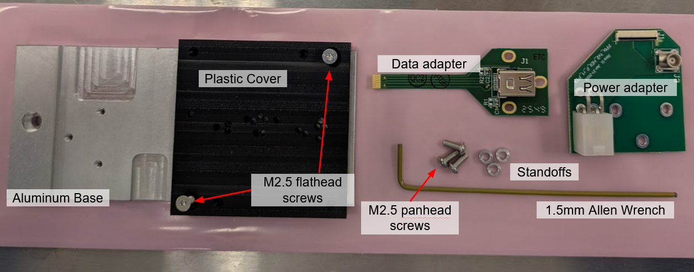
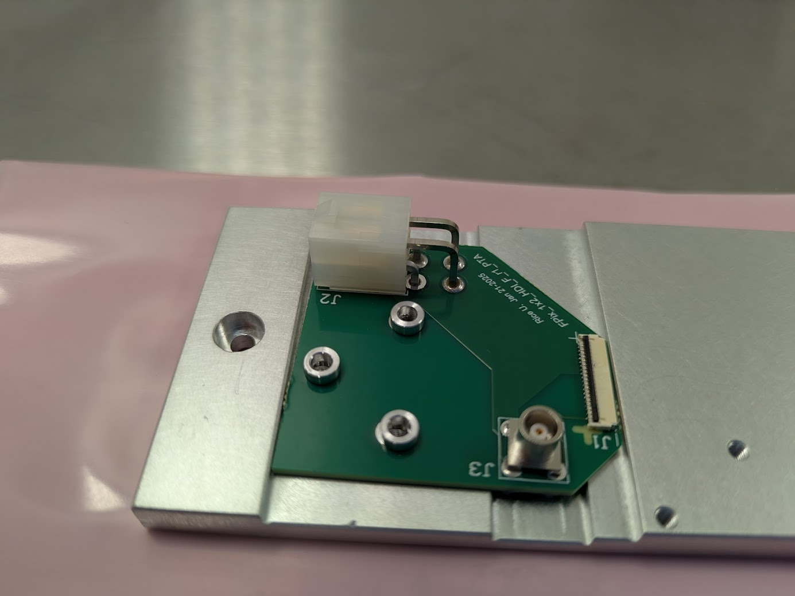
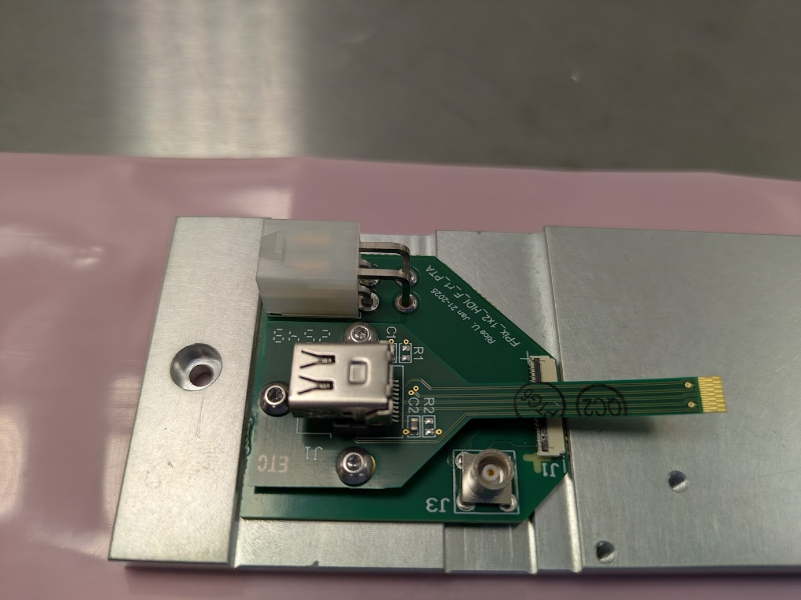
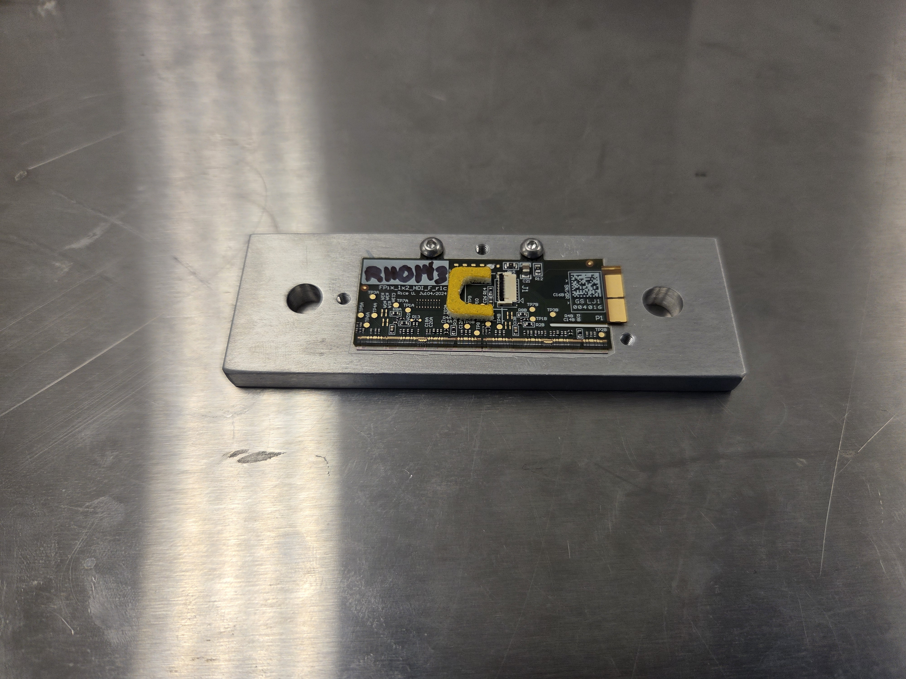
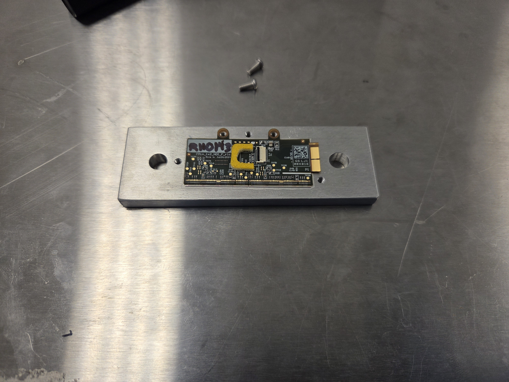
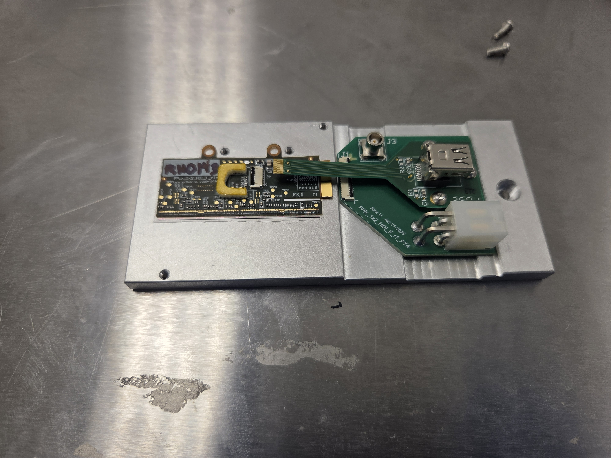
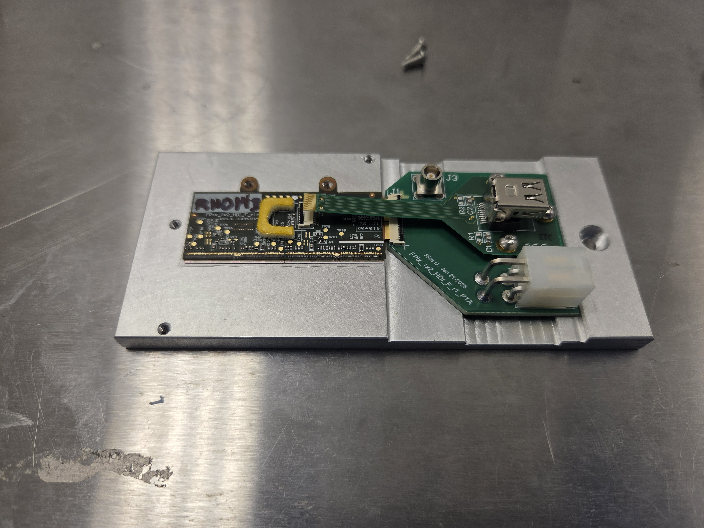
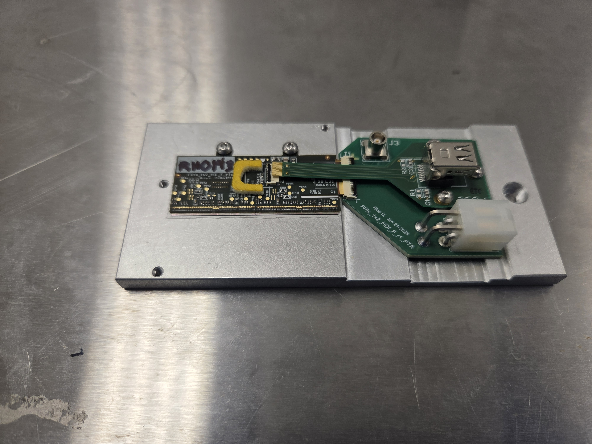
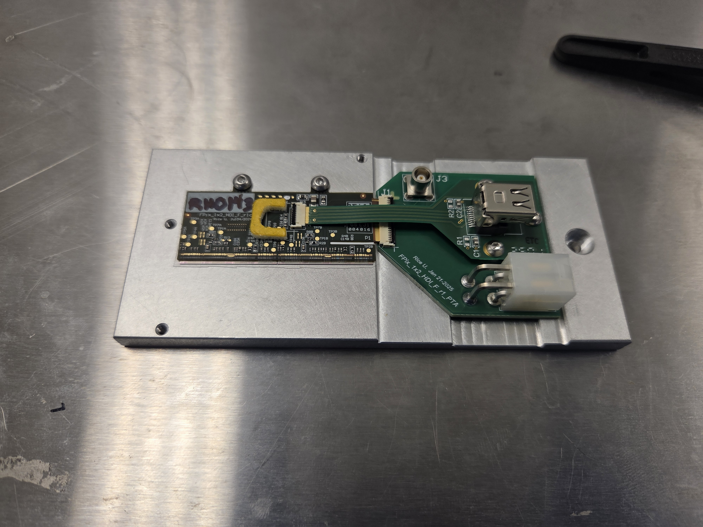
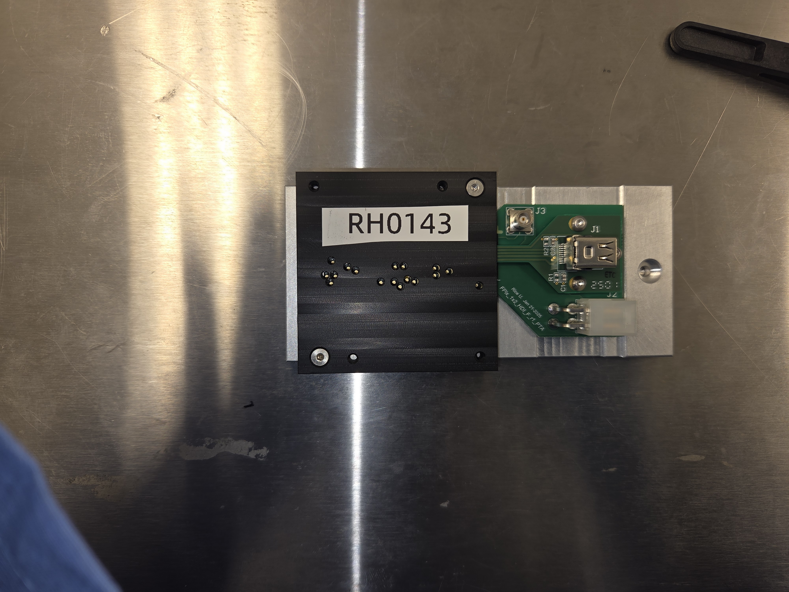

# TFPX-104 CROC 1x2 Testing Carrier Assembly

TFPX module testing carriers (aka "handles") are typically delivered not fully assembled. 
This SOP describes how to assemble them and install the module.

## Required Materials

  - Fully assembled 1x2 CROC module
  - Aluminum base
  - Plastic cover
  - G10 tab (optional)
  - Data adapter board
  - Power adapter board
  - 2x M2.5 flathead screws
  - 3x M2.5 panhead screws
  - 3x Standoffs

## Carrier Assembly Instructions

  1. Remove base and cover from pink plastic sleeve by cutting the end opposite the dessicant packet. Leave
     as much of the bag intact as possible to allow for resealing later.
  2. Remove the plastic cover if already installed and set aside along with flathead screws
  3. Place power adapter and standoffs as shown. Make sure the pins on the bottom of the adapter have been trimmed and are not making contact with the base.
     
  4. Place data adapter on top of standoffs and insert 3x panhead screws through standoffs and into the base.
     Do not tighten the screws, the data adapter should be as loose as it can at this point.
     
  5. If not immediately installing module, re-install plastic cover using flathead screws. Return carrier to pink sleeve and place in storage.

## Module Installation Instructions

### When handling the module, make sure to not touch any wires

1. Retrieve the module that is still screwed into the assembly carrier after wirebonding

2. Unscrew the screws holding the module into the carrier

3. Using a vacuum pen, move the module from the assembly carrier to the testing carrier

4. Slide the module into the power adapter board connector

5. Flip down the black locking lever for the power adapter board connector
6. Screw the module into the testing carrier now that it's aligned (you can use the same screws that were fastening it to the assembly carrier)

7. Slide the data flex cable into the data connector on the HDI (this is easier to do when the data adapter board is loose and not fastened to the testing carrier)

8. Flip down the black locking lever for the data connector
9. Fasten the screws in the data & power adapter boards to the testing carrier
10. Screw the plastic cover onto the testing carrier and label it with the module serial number (make sure that the holes in the top of the cover align with the copper probe points on the HDI)
