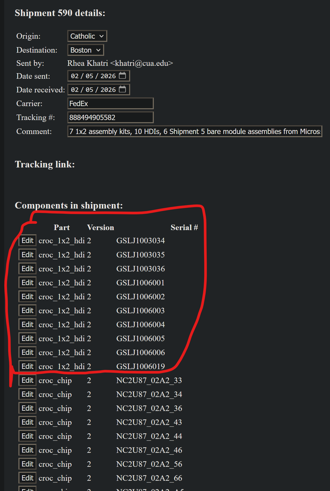
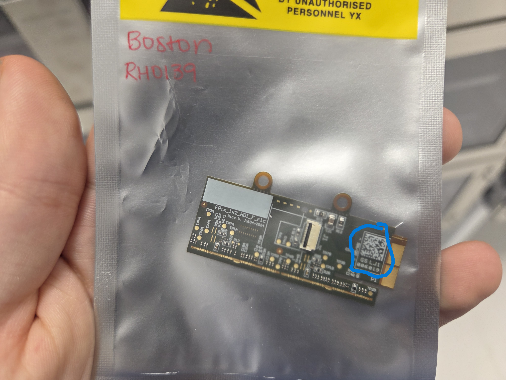
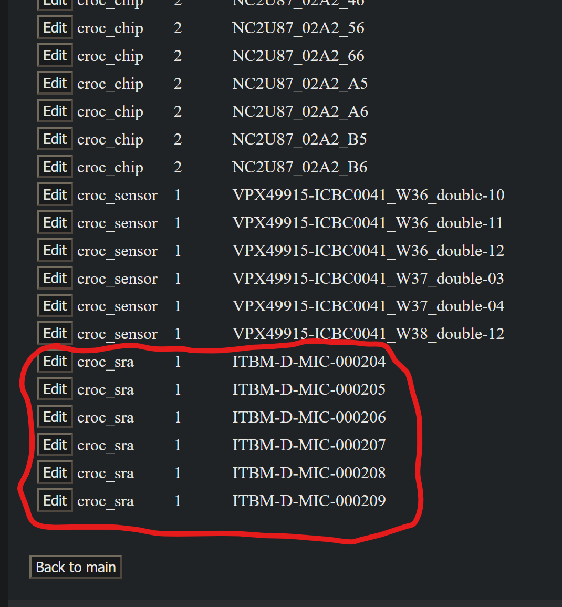
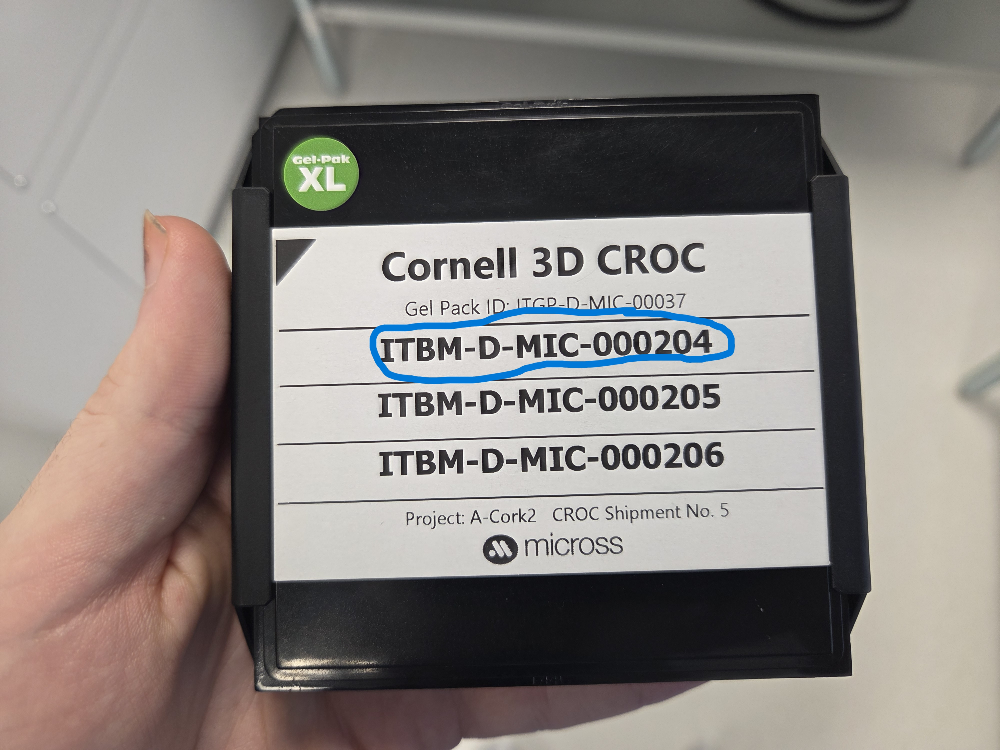

# TFPX-301 Component Reception

`Introduction Placeholder`

## Procedure

### Step 1: Retrieve shipment

First, you should retrieve the shipment that should have been delivered to the physics front office. This office is in Metcalf on the second floor, and the mailroom closet is by the printers in the back. You will need the key with a railroad spike by the mail sign sheet. You should look in the mail closet for the package, and then sign your initials in the entry on the mail sheet.

If the package is not in the physics mailroom and you know that it has been delivered by FedEx, UPS, etc., then you either need to wait another day for processing or check the chemistry mailroom. The chemistry mailroom is found in the chemistry wing of Metcalf also on the second floor. If you don't know where this is you can ask the chemistry front office.

### Step 2: Unpack

Unpack the shipment carefully, making sure not drop any bags or gelpaks inside. You should also verify that everything that you were told would be sent is actually in the package.

### Step 3: Visual inspection

Once you have all the components, you should visually inspect each piece. No need to take and save any images at this point, as you will do this later prior to assembly. Importantly, just look at the SRAs in the gelpak, do not actually touch them or release them using the vacuum tooling. If there are any noticeable damage to any HDIs, SRAs, carriers, or data/power adapters, it should be recorded in a LabLog.

### Step 4: Update Purdue DB

You should now update the Purdue database to reflect that the shipment has been delivered to BU. Navigate to ([this login page](https://www.physics.purdue.edu/cmsfpix/Phase2_Test/main.php)) and log in. You can now follow these steps:

1. Click "Ship Parts"
2. Enter "Boston" into the "Destination" drop down
3. Look for the entry for this particular shipment
4. Click the "Edit" button for the entry
5. Enter in the current date into the "Date received" field

The database should now be updated to so that all shipped components are now marked as being here at BU. Stay on this page and follow the next step.

### Step 7: Match components

Prior to assembly, it is important that HDIs are matched with their corresponding SRA, as the pairings are predefined in the database (you cannot just assemble a random HDI with a random SRA). So, if your shipment contained SRAs and HDIs, you should take the time to read through the Purdue DB and mark on the HDI bags and gelpak labels the predefined module serial number each one belongs to. I recommend doing this in the following way, continuing on from the previous step:

1. Look at the components in the "Components in shipment" section
2. Look for an HDI entry press its "Edit" button (looks like this)

|HDI Entry|
|-|
||

3. Find the physical bagged HDI with the serial number in the "Serial #" field in this edit page

|HDI in Bag|
|-|
||

4. See what its module serial number is by looking at the end of the "Parent part" field (e.g. RH0142)
    - If there is none, then this should be brought up to an advisor so it can be fixed
5. With a sharpie, write this module serial number on the bag that the HDI is in
6. You now want to do this for the SRAs, so start by clicking the "Edit" button for an SRA entry (looks like this)

|SRA Entry|
|-|
||

7. Find the gelpak with the SRA serial number in the "Serial #" field on the top label

|SRA Gelpak|
|-|
||

8. Find its module serial number in the "Parent part" field (e.g. RH0142)
9. With a sharpie, write the module serial number on the gelpak label next to the SRA serial number

After doing this, you should know which SRA belongs with each HDI when you get ready to assemble a module.

### Step 6: Update LabLog

Make a short LabLog entry with the S&R tag (Shipping and Receiving) saying what was received. Also note any damage or other comments you have about the shipment.

### Step 7: Store in dry air cabinet

Put all the components safely in the dry air cabinet for storage.