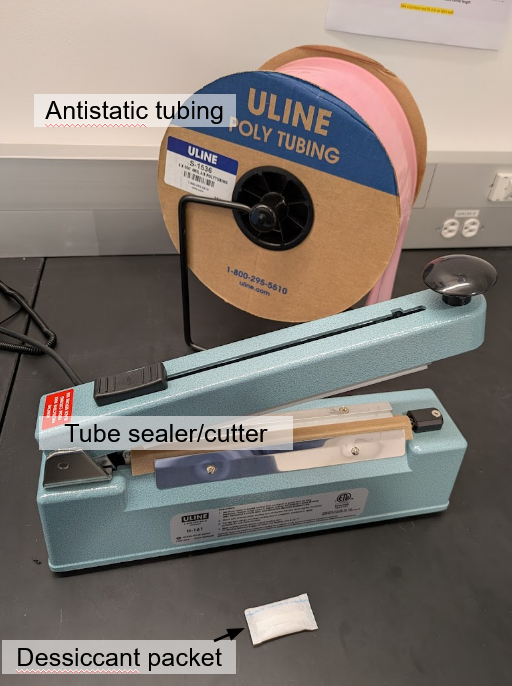
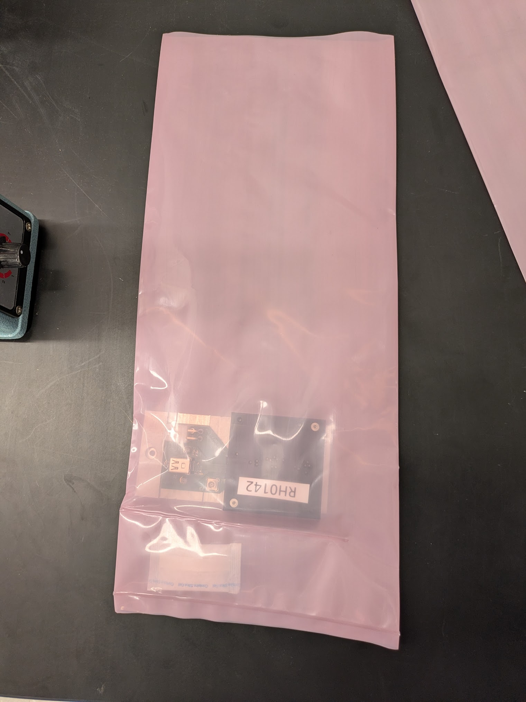
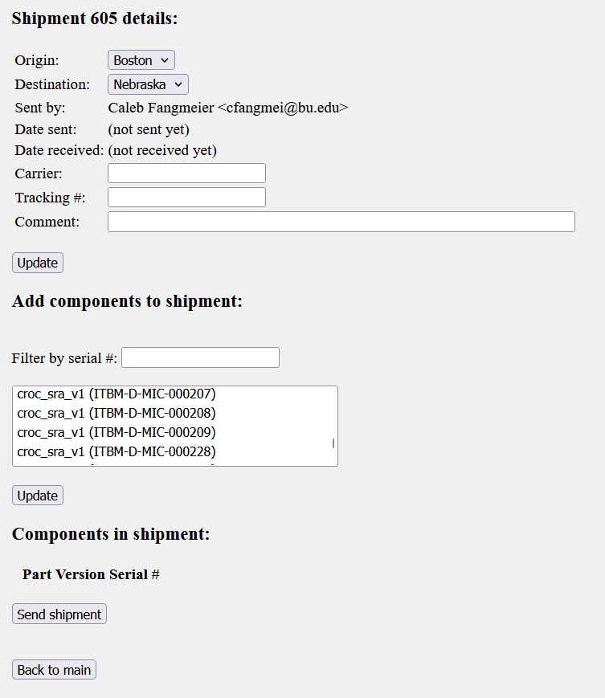

# TFPX-302 Module Shipping

After the module is assembled and tested it will be ready to be shipped out. This SOP will outline the steps to pack and ship the module.

## Required Materials

  - 1+ modules mounted into testing carriers
  - Matching number of pre-made sleeves or sleeve production material (see `Step 0`)
  - Antistatic foam shipper box, At most 4 modules per box
  - Packing tape

## Procedure

### Step 0

If using pre-made sleeves, skip to step 1. Otherwise, prepare the materials shown in Figure 1.

|      |
|:-----------------------------------------:|
| *Figure 1:* Materials for tube production |

To produce a sealable sleeve to ship the module in, follow the steps below:

1. Align the end of the roll of tubing with the tube sealer. Press firmly on the sealer arm and hold in place for 2 seconds.
2. Feed out the roll and use the cutting blade to cut off a 40cm length of tubing. You should now have a "bag" that is sealed on one end.
3. Place a desiccant packet in the bag.
4. Use the sealer to partially seal the section of the tubing with the desiccant, leaving a 2-3cm gap. The gap should be small enough to keep the desiccant in place while allowing air to flow between the two sections.

### Step 1 - Seal in antistatic bag

Collect the modules-in-carriers and matching antistatic bags from the dry air cabinet in the cleanroom. Use the passthrough to transfer the materials to the outer lab area. Once at a time, slide a module-in-carrier into a bag and seal it using the tube sealer/cutter. To seal, place the open end of the bag in the sealer and press the arm down for at least 2 seconds for the seal to form properly. Avoid trapping too much air in the bag while sealing. 

|                     |
|:---------------------------------------------------------------:|
| *Figure 2:* Module installed in antistatic bag (not yet sealed) |

### Step 2 - Register shipment in Purdue database

Take note of all module IDs to be included in the shipment. Then, login to the [purdue database](https://www.physics.purdue.edu/cmsfpix/Phase2_Test/login.php?). After logging in, click the "Ship parts" button, then enter the origin (Boston) and the destination of the shipment, and click "Create." Under the "Add components to shipment" section, Select the modules to be shipped and click "Update." You can use the filter to more easily find the modules of interest from the list. Once satified that the modules in the shipment are correct, click "Send Shipment." Print out the confirmation page with QR code to include with shipment.

|      |
|:-------------------------------------------------:|
| *Figure 3:* Shipment interface in Purdue database |

### Step 3 - Pack in antistatic foam shipper

After all modules have been sealed in antistatic bags, place the bags along with the shipping manifest from Step 2 in the antistatic foam shipper box, max 4 modules per box, and seal the box with packing tape.

### Step 4 - Ship through Physics front office.

Prepare the department [UPS shipping form](https://www.bu.edu/physics/files/2021/04/UPS-Shipment-Form-Fillable.pdf). There is a small scale next to the sink in the outer lab area and a ruler in the toolbox to help complete the form. Under "Charge To:" put "MREFC Pixel Project". Bring shipment and form to the front office and the staff there will arrange for pickup with UPS. They will also provide you with tracking information upon request. Once you have tracking information, update the shipment in the purdue database with the carrier and tracking number.
